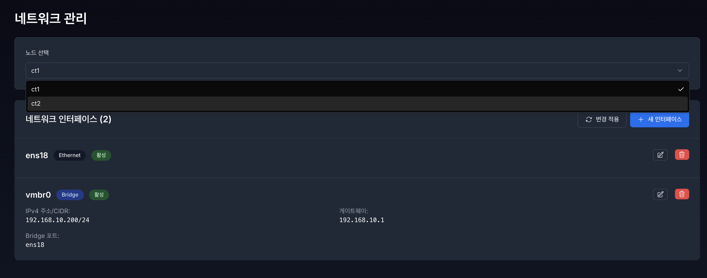
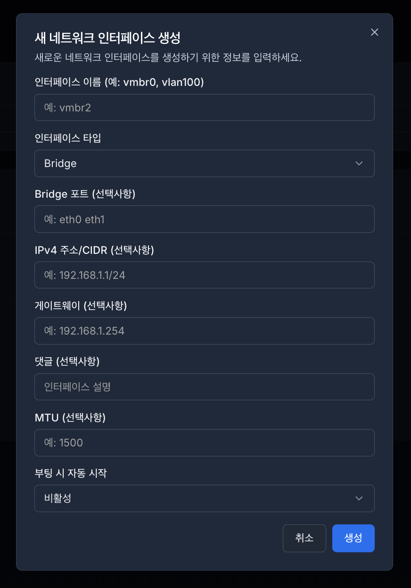
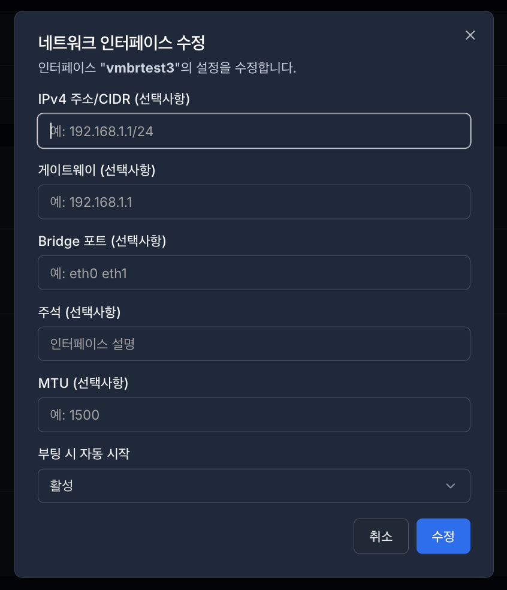
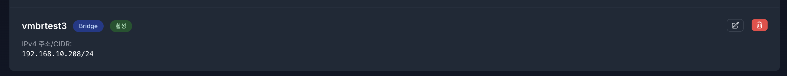

# **11. 네트워크 (Network)**

네트워크 관리 기능은 **서버의 물리적 인터페이스와 가상 머신(VM) 간의 통신 경로를 통합적으로 설정하고 제어**하는 도구입니다. 복잡한 리눅스 네트워크 구성을 GUI 환경에서 직관적으로 관리하여 인프라의 통신 안정성을 확보합니다.

## 11.1 네트워크 인터페이스 설정

- 네트워크 인터페이스는 **구성되어 있는 클러스터의 첫번 째 노드의 인터페이스** 부터 로드 됩니다.
- **구성되어 있는 클러스터(노드)**를 선택 후 **해당 노드의 네트워크 인터페이스 목록 조회**가 가능합니다.
- **노드 목록이 안보일 시 로그인 재 확인이 필요합니다.`(로그인이 안되어 있을 시 노드 목록을 안보입니다.)`**

## 11.2 인터페이스 관리 - 새 인터페이스(네트워크) 생성

## Bridge 타입

- **인터페이스 이름**
  - **영문, 숫자만 생성 가능합니다.**
  - **이름만 입력 후 생성 가능합니다.**
- **Bridge 포트 (선택사항)**
  - **브릿지에 연결할 물리 포트를 선택합니다.**
  - **ex) eth0, eno1, ens1**
- **IPv4 주소/CIDR (선택사항)**
  - **IP주소 입력시 CIDR입력 필수 - \*미입력 시 생성 제한합니다.**
- **게이트 웨이 (선택사항)**
  - **외부 네트워크 접근 필요 시 설정합니다.**
- **댓글 (선택사항)**
  - **사용자의 구분을 위한 Comment(메모)**
- **MTU (선택사항)**
  - **한번에 보낼 수 있는 데이터 패킷의 최대 크기입니다.**
  - **기본값은 1500입니다.**
- **부팅 시 자동 시작 (autostart)**
  - **서버 부팅 시 해당 인터페이스를 자동으로 활성화 하는 기능입니다.**

---

## VLAN 타입

- **인터페이스 이름**
  - **영문, 숫자만 생성 가능합니다.**
  - **이름만 입력 후 생성 가능합니다.**
- **VLAN ID**
  - **태그번호 분류 위합니다.**
  - **범위: 1~4094**
  - **기본값: 1**
  - **중복 불가능**
- **VLAN Raw Device(필수)**
  - **VLN이 기반할 물리 포트 입니다.**
  - **포트가 활성화 되어야 합니다.**
  - **하나의 포트에 여러 VLAN 가능 합니다.**
- **IPv4 주소/CIDR (선택사항)**
  - **IP주소 입력시 CIDR입력 필수 - \*미입력 시 생성 제한 합니다.**
- **게이트 웨이 (선택사항)**
  - **외부 네트워크 접근 필요 시 설정합니다.**
- **댓글 (선택사항)**
  - **사용자의 구분을 위한 Comment(메모)**
- **MTU (선택사항)**
  - **한번에 보낼 수 있는 데이터 패킷의 최대 크기입니다.**
  - **기본값은 1500 입니다.**
- **부팅 시 자동 시작 (autostart)**
  - **서버 부팅 시 해당 인터페이스를 자동으로 활성화 하는 기능입니다.**

---

## Bond 타입

- **인터페이스 이름**
  - **영문, 숫자만 생성 가능합니다.**
  - **이름만 입력 후 생성 가능합니다.**
- **Slaves (선택사항)**
  - **Bond에 포함할 물리 포트들**
  - **최소 2개 필요**
  - **공백으로 구분: `"eth0 eth1"` 또는 `"eth0 eth1 eth2”`**
  - **한 포트는 한 인터페이스만 사용 가능합니다.**
- **Bond Mode (선택사항)**
  - **Active-Backup: 안정성 우선 (권장)**
    - **스위치 설정 불필요**
    - **간단한 구성**
  - **802.3ad (LACP): 성능 우선**
    - **스위치가 LACP를 지원해야 합니다.**
    - **대역폭 증가**
    - **고성능 네트워크용**
- **IPv4 주소/CIDR (선택사항)**
  - **IP주소 입력시 CIDR입력 필수 - \*미입력 시 생성 제한합니다.**
- **게이트 웨이 (선택사항)**
  - **외부 네트워크 접근 필요 시 설정합니다.**
- **댓글 (선택사항)**
  - **사용자의 구분을 위한 Comment(메모) 입니다.**
- **MTU (선택사항)**
  - **한번에 보낼 수 있는 데이터 패킷의 최대 크기입니다.**
  - **기본값은 1500입니다.**
- **부팅 시 자동 시작 (autostart)**
  - **서버 부팅 시 해당 인터페이스를 자동으로 활성화 하는 기능입니다.**

---

## 11.2.1 변경 적용 - Apply Configuration **[ 🔄 변경 적용 ]**

- **네트워크 생성시 비활성화 상태로 표시됩니다.**

- **네트워크 활성화**
  - 변경 적용 버튼 클릭 시 변경 적용중이 표시됩니다.

- **활성화된 네트워크 상태 표시 변경**

---

## 11.2.2 네트워크 수정 - Edit

- **각 네트워크 인터페이스 우측에 수정, 삭제 버튼이 있습니다.**

- **해당 네트워크의 수정버튼을 클릭하면 설정되어있는 네트워크의 정보를 불러옵니다.** **ex)vmbrtest3**

- **IPv4 적용 예시**
  1. **수정할 정보 입력합니다.**

     

  2. **수정 버튼 클릭 시 변경 적용중이 표시됩니다.**

     

  3. **수정된 네트워크의 정보를 확인합니다.**

     

---

## 11.2.3 네트워크 삭제 - Remove 🗑️

1. 해당 네트워크의 삭제버튼 클릭 시 확인 알림창이 표시 됩니다.

   

2. 삭제 버튼 클릭시 해당 네트워크 인터페이스 삭제 중으로 표시됩니다.

   

3. 네트워크 인터페이스 목록을 확인합니다.

   
