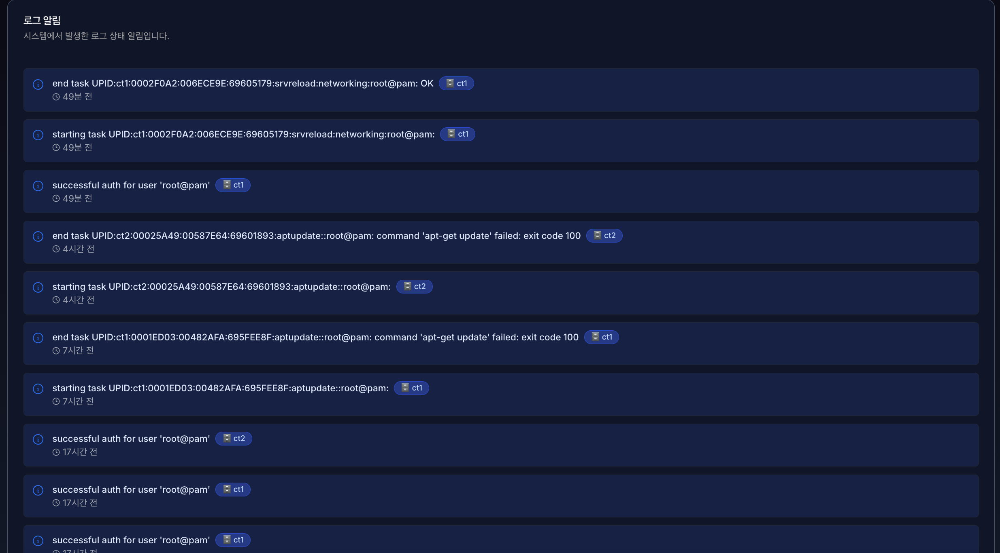

# **12. 알림 (Notifications)**

알림 페이지에서 **작업(Tasks)**과 **로그(Cluster Log)**는 시스템에서 발생하는 모든 유효한 행위를 추적하고 기록하는 핵심 기능입니다.

## 12.1 작업 로그 및 이력

> **Tasks**는 서버에서 실행된 **개별적인 작업(Process)의 상세 실행 기록**을 보여줍니다. 가상 머신의 시작/종료, 백업, 스냅샷 생성 등 시간이 소요되는 모든 능동적인 행위가 여기에 기록됩니다.
> 
- **상세 상태 확인:** 작업이 현재 진행 중(Running)인지, 성공(OK)했는지, 실패(Error)했는지를 실시간으로 추적합니다.

> **Cluster Log**는 개별 노드에서 발생하는 Tasks를 포함하여, **클러스터 전체 시스템에서 발생하는 주요 이벤트**를 시간순으로 요약해서 보여주는 통합 뷰어입니다.
> 
- **통합 모니터링:** 여러 대의 노드가 묶인 환경에서 "누가, 언제, 어떤 노드에서, 무엇을 했는지" 한눈에 파악할 수 있게 해줍니다.
- **시스템 이벤트 기록:** 사용자가 의도한 작업뿐만 아니라, 클러스터 쿼럼(Quorum) 변화, 노드 온라인/오프라인 상태 등 시스템 내부의 자동적인 변화도 기록됩니다.

### 12.2 로그 관리

- 각 알림은 최대 20개까지 보이며, 1분다마 실시간으로 업데이트 됩니다.
- 또는, **새로고침** 으로 즉시 업데이트 할 수 있습니다.

- 우측 상단 메뉴에 🔔 버튼 클릭 시 최근 알림창이 표시되며,
**모든 알림 보기** 버튼 클릭 시 알림 페이지로 이동합니다.