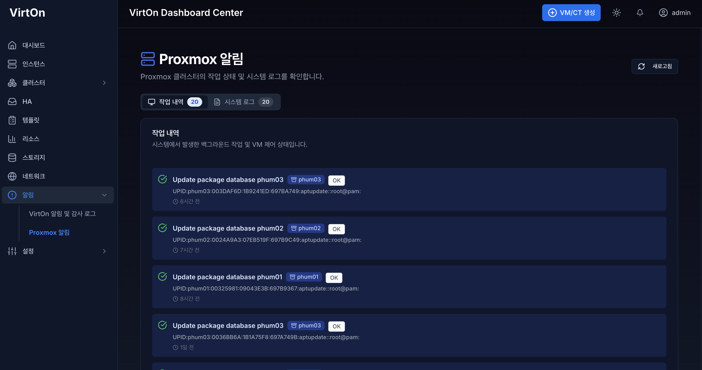
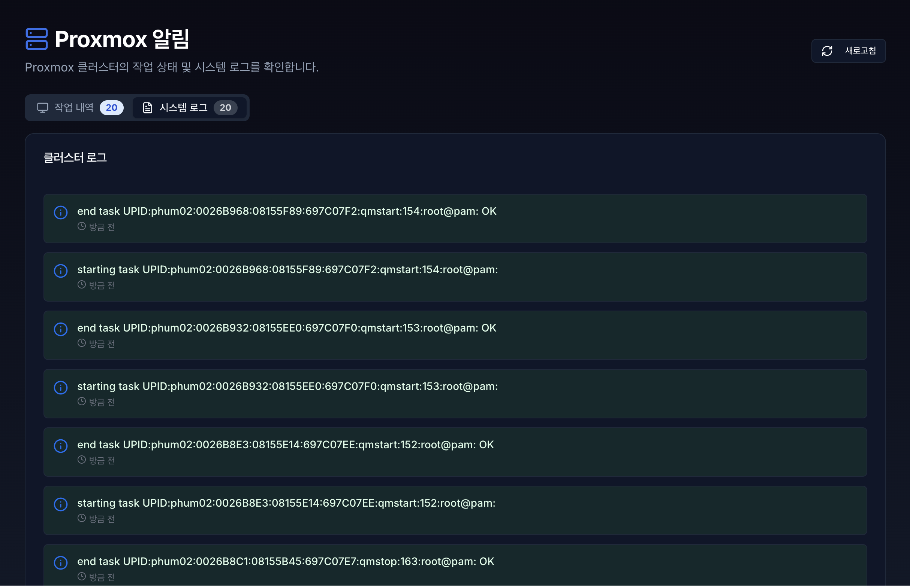

# **12. 알림 (Notifications)**

- 알림 페이지는 보안 경고 알림과 작업(Tasks) 그리고 로그(Cluster Log)는 시스템에서 발생하는 보안 감사 알림과 행위를 추적하고 기록하는 핵심 기능입니다.
- 각 알림은 최대 20개까지 보이며, 1분다마 실시간으로 업데이트 됩니다.
- 또는, **새로고침** 으로 즉시 업데이트 할 수 있습니다.

## 12.1 보안 경고 알림

- **보안 경고 목록** : 사용자의 계정 잠금, 비정상 접속 시도 등 보안 관련 중요 알림입니다.
- **권한에 따른 경고 목록** : 보안 경고 목록은 권한(role)에 따라 다르게 보입니다.
    1. **ADMIN 및 SUPER ADMIN** : 모든 사용자의 보안 관련 알림을 확인할 수 있으며, 관련 IP 블랙리스트 차단 및 유저 잠금 해제가 가능합니다.
    2. **USER 및 VIEWER** : 로그인 한 사용자의 보안 관련 알림만 확인이 가능합니다.
- **잠금 해제 버튼** : 로그인 실패로 잠금 처리 되어진 계정의 잠금을 즉시 해제할 수 있습니다.
- **IP 차단** : 보안 관련 알림에서 의심되는 IP를 즉시 차단 합니다. 총 3개의 상태가 있습니다.
    1. **IP 차단** : 의심되는 IP를 즉시 차단 합니다.
    2. **차단됨** : 이미 차단 되어진 IP입니다.
    3. **신뢰 IP** : 화이트리스트에 등록된 신뢰 IP입니다.

---

## 12.2 작업 (tasks) 이력

> **Tasks**는 서버에서 실행된 **개별적인 작업(Process)의 상세 실행 기록**을 보여줍니다. 가상 머신의 시작/종료, 백업, 스냅샷 생성 등 시간이 소요되는 모든 능동적인 행위가 여기에 기록됩니다.
> 
- **상세 상태 확인:** 작업이 현재 진행 중(Running)인지, 성공(OK)했는지, 실패(Error)했는지를 실시간으로 추적합니다.
- **통합 모니터링:** 여러 대의 노드가 묶인 환경에서 "누가, 언제, 어떤 노드에서, 무엇을 했는지" 한눈에 파악할 수 있게 해줍니다.
- **시스템 이벤트 기록:** 사용자가 의도한 작업뿐만 아니라, 클러스터 쿼럼(Quorum) 변화, 노드 온라인/오프라인 상태 등 시스템 내부의 자동적인 변화도 기록됩니다.

---

### 12.3 클러스터 로그 이력

> **Cluster Log**는 개별 노드에서 발생하는 Tasks를 포함하여, **클러스터 전체 시스템에서 발생하는 주요 이벤트**를 시간순으로 요약해서 보여주는 통합 뷰어입니다.
> 

---

### 12.4 상단 및 하단 알림

- **우측 상단 메뉴** : 종 모양의 버튼을 클릭 시 보안 경고 알림과 최근 알림 3개가 표시되며, **모든 알림 보기** 버튼 클릭 시 알림 페이지로 이동합니다.
- **우측 하단 경고 알림** : 보안 위협이 감지된 읽지않은 알림이 있다면, 계속해서 표시됩니다.
    1. 닫기 : 읽을 때 까지 화면 이동 시에 경고 알림 창이 다시 표시됩니다. 
    2. 확인하기 : 즉시 알림 페이지로 이동합니다.
- **새로운 알림** : 새로운 보안 관련 경고 알림이 있다면 알림을 읽을 때 까지, 상단 종 모양 옆의 빨간 점과 하단의 경고 표시는 닫기 전까지 사라지지 않습니다.