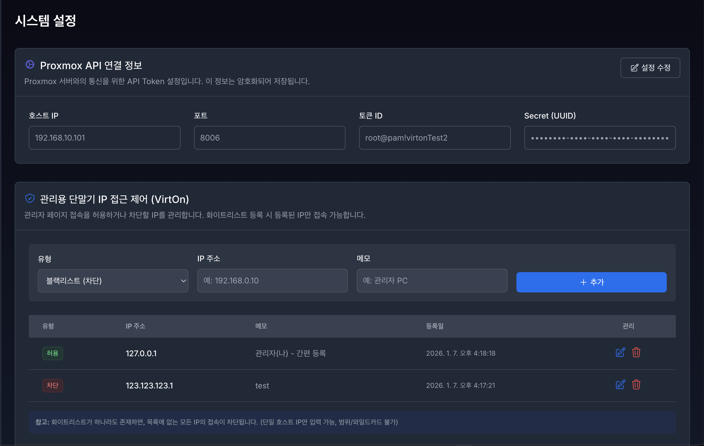
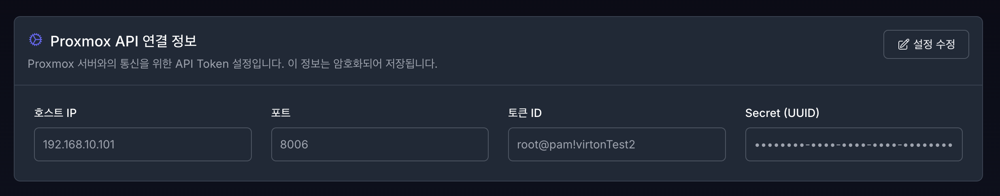
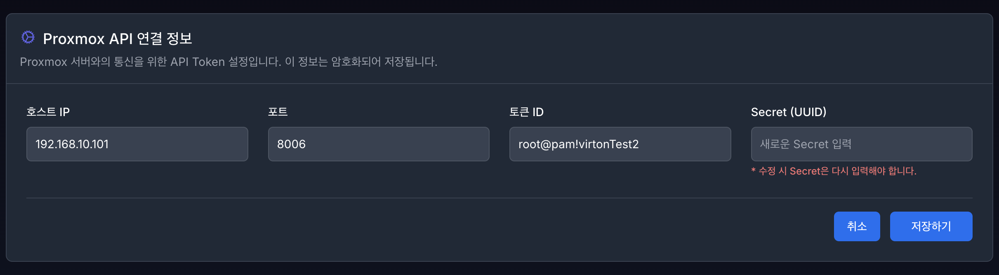
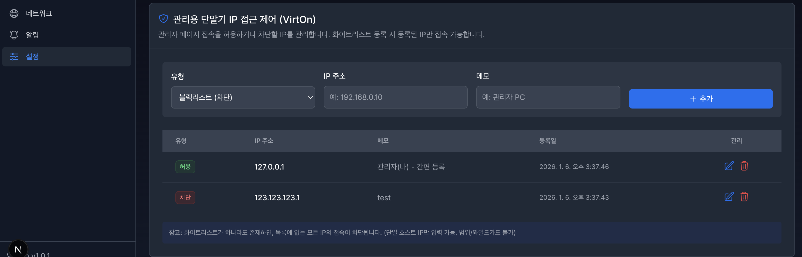

# **13. 설정 (Settings)**

VirtOn 시스템의 핵심 기능을 사용하기 위해서는 Proxmox 서버 연동이 필수이며,  
관리자 페이지 보안을 위해 IP 접근 제어 기능을 제공합니다.

---

## 1. Proxmox API 연결 설정

VirtOn이 가상머신(VM)을 제어하고 모니터링하기 위해 Proxmox VE 서버와의 API 통신을 설정합니다. 

### 1.1 입력 항목 설명

| 항목 | 설명 | 예시 |
|----|----|----|
| 호스트 (Host) | Proxmox VE 서버의 IP 또는 도메인 (`http://` 제외) | `123.456.0.100`, `pve.example.com` |
| 포트 (Port) | Proxmox API 포트 (기본값) | `8006` |
| 토큰 ID | `계정명@인증영역!토큰명` 형식 | `root@pam!Test1`, `admin@pve!Test1` |
| 시크릿 키 | 해당 토큰의 시크릿 키 값 (암호화 저장) | - |

### 1.2 주요 기능 버튼

- **설정 수정**  
  저장된 검증 연결 정보를 수정하고 즉시 시스템에 반영합니다.

  - **"SUPER_ADMIN"** 및 **"ADMIN"** Role이 아니라면 수정은 불가능 합니다. 수정을 원한다면 관리자 계정에게 문의해주세요.
  - 모든 값을 입력하지 않거나 알맞은 값을 입력하지 않으면 수정은 불가합니다.

> 💡 **참고**  
> 설정 저장 후 VM 목록이 보이지 않는 경우, 네트워크 방화벽 설정 또는  
> Proxmox 사용자 권한(Permission)을 확인하세요.

---

## 2. 관리자 IP 접근 제어 (IP Access Control)

VirtOn은 외부 공격 및 비인가 접근을 방지하기 위해  
IP 기반 접근 제어(화이트리스트 / 블랙리스트)를 제공합니다.

### 2.1 보안 정책 (작동 원리)

시스템은 화이트리스트 등록 상태에 따라 자동으로 모드가 전환됩니다.

#### 개방 모드 (Open Mode)
- **조건**: 화이트리스트 IP가 0개일 경우
- **동작**: 블랙리스트에 없는 모든 IP 접근 허용

#### 잠금 모드 (Lockdown Mode)
- **조건**: 화이트리스트 IP가 1개 이상 등록될 경우
- **동작**: 화이트리스트 IP만 접근 허용 (강력 보안)

---

### 2.2 주요 기능 사용법

#### 2.2.1 내 IP 간편 등록 (권장)

화이트리스트 최초 설정 시, 본인 IP 차단을 방지하기 위한 기능입니다.

1. 상단 경고 배너 **“현재 접속 중인 IP가 화이트리스트에 없습니다!”** 확인
2. **[내 IP 입력하기]** 버튼 클릭
3. 자동 입력된 IP 확인 후 **[추가]** 클릭

---

#### 2.2.2 IP 직접 등록

- **유형 선택**
  - `WHITELIST`: 허용 IP (관리자 PC, 사무실 IP)
  - `BLACKLIST`: 차단 IP (공격 의심 IP 등)

- **IP 주소**
  - 단일 IP만 허용  
  - 예: `123.456.0.10`
  - ❌ 와일드카드, CIDR(`192.168.0.0/24`) 불가

- **메모**
  - 식별 가능한 설명 입력  
  - 예: `OOO 팀장 자택`

---

#### 2.2.3 IP 수정 및 삭제

- **IP 수정** : 리스트 더블 클릭 혹은 펜슬 아이콘 클릭 시 사용 가능, 수정 방법은 IP 직접 등록과 동일
- **IP 삭제** : 리스트 쓰레기통 아이콘 클릭 시 삭제 가능

---

#### 2.2.4 자동 차단 (IPS)

- 짧은 시간 내 반복 로그인 실패 IP는 자동 블랙리스트 등록
- 오차단 시 목록에서 해당 IP를 찾아 **[삭제]** 버튼 클릭 시 즉시 해제

---

### 2.3 긴급 조치 가이드 (Lockout 상황)

유일한 화이트리스트 IP 삭제 또는  
등록되지 않은 위치에서의 긴급 접속이 필요한 경우 접근이 차단될 수 있습니다.

이 경우 **DB 관리자에게 직접 연락하여 조치**를 받아야 합니다.

---
