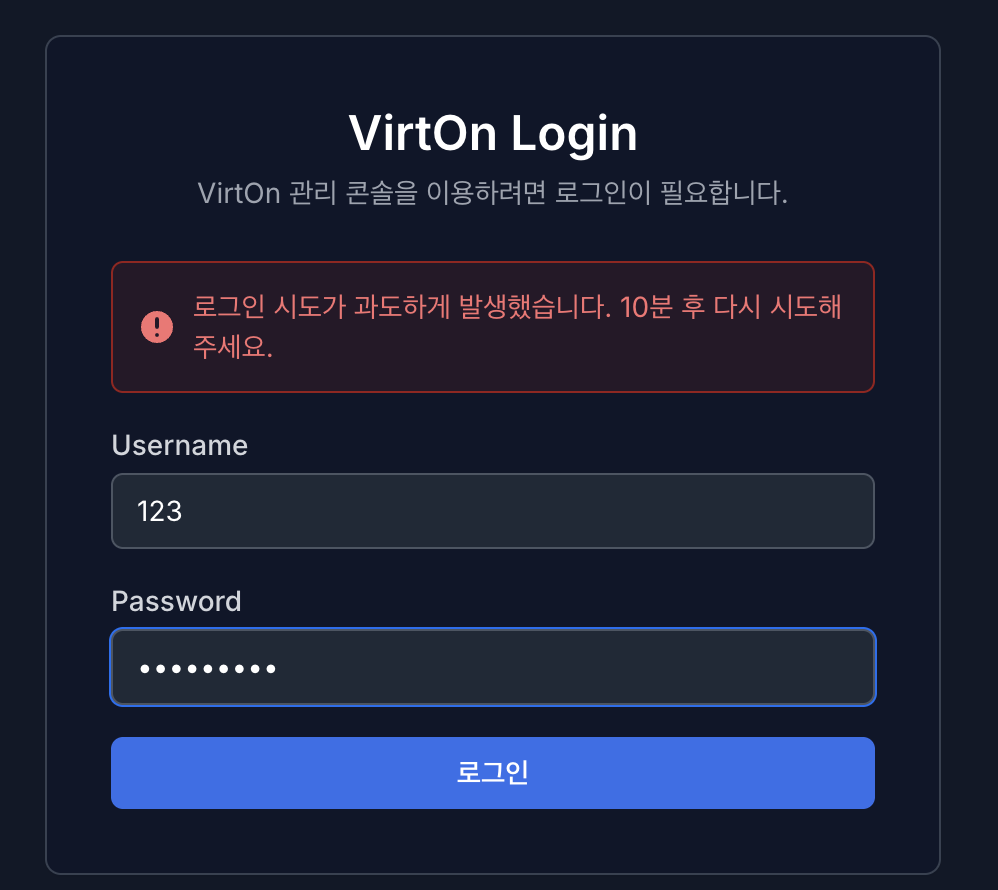
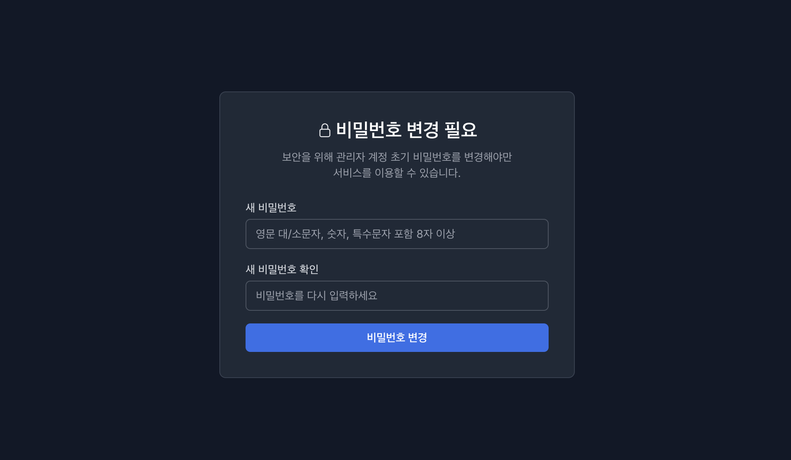

# **2. 로그인 (Login)**

로그인 페이지는 VirtOn의 루트 페이지입니다.

* **로그인** : VirtOn을 이용하기 위해서는 VirtOn 전용 아이디와 비밀번호가 필요합니다.
* **기본 관리자 계정** : 초기 아이디는 **admin**, 비밀번호는 **Admin001!** 입니다.

### **1.1. 로그인 실패 정책**

로그인을 실패하는 상황에 대한 보안 정책입니다.

* **계정 정보 불일치** : 유저명(아이디) 및 비밀번호를 틀릴 시, **“아이디 또는 비밀번호가 올바르지 않습니다.”** 문구가 출력됩니다.
* **로그인 시도 차단** : 로그인을 짧은 시간 안에 **5회 이상 시도** 시, 같은 IP 또는 동일한 아이디에서 로그인 시도가 **10분 동안 차단**됩니다.
* IP를 기준으로 한 차단은 하나의 IP에서 각각 다른 아이디로 5회 이상 시도하여도 차단됩니다.
* 아이디를 기준으로 한 차단은 하나의 유저로 각각 다른 비밀번호를 통해 5회 이상 시도하여도 아이디가 차단됩니다.
* **중복 로그인** : 보안 정책상, 중복 로그인은 불가합니다. 세션은 이후 로그인 세션을 기준으로 동작하며 이전 로그인은 차단 됩니다.

### **1.2. 관리자 비밀번호 변경 페이지**

첫 관리자 계정 로그인 후 이동되는 비밀번호 변경 페이지입니다.

* **필수 변경 정책** : 기본 제공되는 관리 계정은 첫 로그인 시, **비밀번호를 무조건 변경**해야 합니다. (변경하지 않으면 VirtOn 서비스를 이용할 수 없습니다.)
* **비밀번호 복잡도** : 비밀번호를 변경하기 위해서는 다음과 같은 조건이 필요합니다.
    * **영문 대/소문자, 숫자, 특수문자 포함 9자 이상**
    * **동일 문자 3회 연속 금지**
    * **키보드/숫자 연속 순차 입력 금지**
    * **사용자 아이디와 동일하게 입력**
    * **이전 비밀번호 재사용이 불가**
* **확인 절차** : 정확성을 위해 비밀번호는 한 번 더 입력하며, 비밀번호가 조건에 맞게 올바르게 작성되어야 변경이 가능합니다.

* 다음과 같이 (“1234” 입력 시), 만족한 조건은 체크 표시로 UI가 달라지며 편의성을 제공합니다.
* 조건 만족과 새 비밀번호 확인이 끝날 때 까지는 비밀번호 변경 버튼이 활성화되지 않습니다.

* 단, 조건 만족과 새 비밀번호 확인이 끝났다 해도 비밀번호 변경 버튼을 클릭 시, 이전 비밀번호를 재사용 한다면 에러 메시지와 함께 변경이 불가능합니다.

---

# **2. 로그아웃**

### **2.1. 로그아웃 및 세션 만료**

VirtOn의 사용을 종료하거나 세션이 만료되었을 때의 정책입니다.

* **로그아웃 방법** : 오른쪽 상단 **계정 아이콘**을 눌러 로그아웃 합니다.
* **Proxmox 연동** : 로그아웃 시, 연결된 **Proxmox API 연결도 함께 로그아웃** 됩니다.
* **세션 지속 시간** : 세션의 지속 시간은 **3시간**입니다. 3시간이 지나면 세션이 만료되어 VirtOn 로그인을 다시 진행하여야 합니다.
* **세션 만료 시 편의성** : 단, 세션 만료로 인한 자동 로그아웃의 경우 **Proxmox API 정보**를 다시 작성하지 않아도 됩니다.

---

# **3. 블랙리스트 & 화이트리스트**

VirtOn 시스템은 외부의 무분별한 접속 시도와 해킹 위협으로부터 시스템을 보호하기 위해 강력한 IP 접근 제어 시스템을 운영합니다. 관리자는 신뢰할 수 있는 IP(화이트리스트)를 등록하여 보안을 강화할 수 있습니다.

### **3.1. 로그인 관련 블랙리스트 & 화이트리스트**

* **로그인 실패 블랙리스트** : 최근 1시간 내 3번의 로그인 임시 차단 (10분 차단)이 있을 시, 비정상적인 접근으로 판단하여 해당 접속 IP가 블랙리스트에 등재되어 차단됩니다.

* **화이트리스트에 포함되지 않은 IP 접근 시** : 화이트리스트 IP가 미설정 상태일 때는 접근 제한이 없으나, 화이트리스트가 설정되면 등록된 IP만 로그인이 허용됩니다.
* **화이트리스트 일 때의 로그인 실패** : 화이트리스트로 등재된 IP로 로그인 차단 기준까지 실패할 경우, 차단은 되지 않으나 잠시 후 로그인을 시도 하셔야 합니다.
