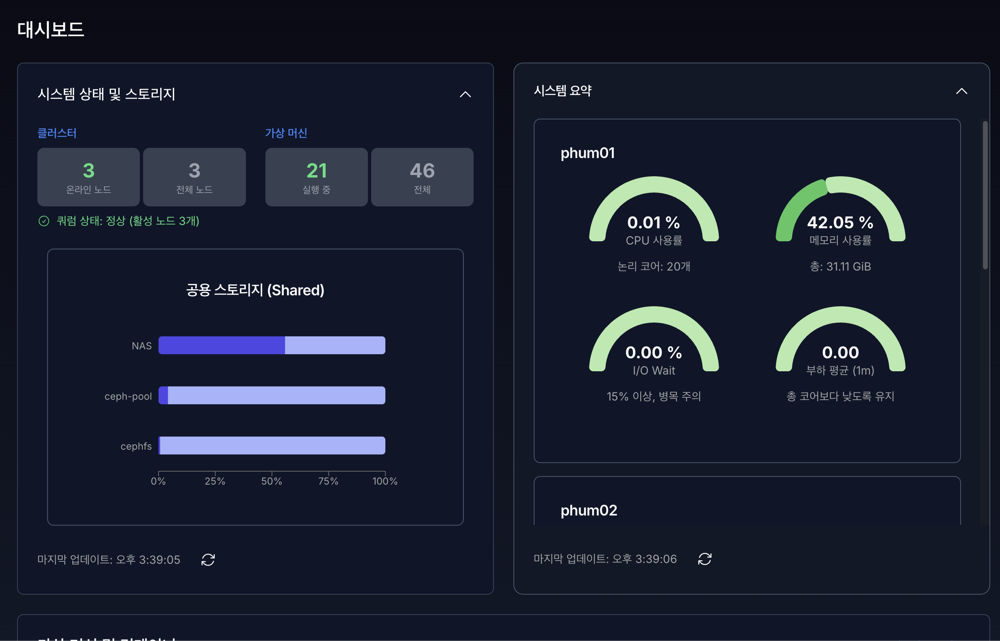

# **3. 대시보드 (Dashboard)**

대시보드는 VirtOn 시스템의 **전체 상태를 한눈에 파악하고**,  
주요 리소스(VM/컨테이너)의 상태 확인 및 기본 제어를 수행하는 핵심 화면입니다.

대시보드는 다음 영역으로 구성됩니다.
- 시스템 상태 요약
- 시스템 상세 요약
- 가상 머신 및 컨테이너 목록

---

## 2.1 시스템 상태 요약

시스템 상태 요약 영역에서는 **클러스터 전체 상태와 가상 머신 실행 현황**을 확인할 수 있습니다.

### 주요 표시 항목

#### 클러스터 상태
- **온라인 노드**  
  현재 정상적으로 동작 중인 노드 수를 표시합니다.
- **전체 노드**  
  클러스터에 등록된 전체 노드 수를 표시합니다.

#### 쿼럼(Quorum) 상태
- 클러스터의 **정상 동작 여부**를 판단하는 기준입니다.
- 쿼럼이 정상일 경우:
  - “쿼럼 상태: 정상”
  - 활성 노드 수가 함께 표시됩니다.
- 쿼럼이 비정상일 경우:
  - “쿼럼 상태: 비정상”
  - HA 및 일부 클러스터 기능이 제한될 수 있습니다.

#### 가상 머신 상태
- **실행 중**: 현재 동작 중인 VM/CT 수
- **전체**: 시스템에 등록된 전체 VM/CT 수

---

### 스토리지 상태

시스템 상태 요약 하단에는 **공유 스토리지 상태 정보**가 표시됩니다.

- 클러스터에서 사용하는 스토리지 목록
- 스토리지별 사용량 및 상태
- 스토리지 접근 가능 여부

---

### 자동 갱신 및 수동 새로고침

- 대시보드 정보는 **주기적으로 자동 갱신**됩니다.
- 우측 하단의 새로고침 버튼을 클릭하면 즉시 상태를 다시 조회할 수 있습니다.
- 마지막 데이터 갱신 시간이 함께 표시됩니다.

---

## 2.2 시스템 요약

시스템 요약 영역에서는 **각 노드별 상태를 상세하게 확인**할 수 있습니다.

### 주요 기능

- 클러스터에 속한 모든 노드 목록 표시
- 각 노드의:
  - 상태 (온라인 / 오프라인)
  - 자원 상태 요약
- 스크롤을 통해 다수 노드도 확인 가능

### 접기 / 펼치기

- 제목 영역을 클릭하면 요약 영역을 접거나 펼칠 수 있습니다.
- 기본적으로 펼쳐진 상태로 표시됩니다.

### 오류 및 연결 상태

- Proxmox 연결이 설정되지 않은 경우:
  - “Proxmox 설정이 필요합니다” 안내 메시지가 표시됩니다.
- 데이터 조회 실패 시:
  - 오류 메시지가 표시되며 상태 확인이 제한됩니다.

---

## 2.3 가상 머신 및 컨테이너 목록

이 영역에서는 **최근 가상 머신 및 컨테이너 상태를 빠르게 확인하고 제어**할 수 있습니다.

### 표시 대상

- 최근 생성되거나 변경된 **최대 5개의 VM/CT**가 표시됩니다.
- 전체 목록은 “모든 인스턴스 보기”를 통해 이동할 수 있습니다.

---

### 표시 항목 설명

| 항목 | 설명 |
|----|----|
| **ID** | 가상 머신 또는 컨테이너의 고유 ID |
| **이름** | 리소스 이름 |
| **유형** | 가상 머신(KVM) 또는 컨테이너(CT) |
| **상태** | 실행 중 / 중지됨 / 일시 중지 |
| **노드** | 현재 실행 중인 노드 |
| **CPU** | 할당된 CPU 코어 수 |
| **메모리** | 할당된 메모리 용량 |
| **작업** | 제어 및 접근 기능 |

---

### 상태(Status) 안내

- **실행 중**  
  리소스가 정상적으로 동작 중인 상태
- **중지됨**  
  리소스가 정지된 상태
- **일시 중지**  
  리소스가 일시 중단된 상태

상태에 따라 색상 배지가 다르게 표시되어 시각적으로 구분됩니다.

---

### 작업(Action) 버튼 설명

| 아이콘 | 기능 |
|----|----|
| ▶️ | 가상 머신 또는 컨테이너 시작 |
| ⏹️ | 실행 중인 리소스 중지 |
| 🔄 | 리소스 재시작 |
| 🖥️ | 콘솔 접속 |
| ⚙️ | 상세 설정 화면 이동 |

- 재시작 버튼은 **실행 중 상태**에서만 활성화됩니다.
- 콘솔 버튼을 통해 웹 기반 콘솔에 바로 접근할 수 있습니다.

---

## 2.4 운영 가이드 요약

- 대시보드는 **시스템 전반 상태를 즉시 확인**하는 용도로 사용합니다.
- 쿼럼 상태 이상은 HA 동작에 직접적인 영향을 주므로 즉시 확인이 필요합니다.
- VM/CT 기본 제어는 대시보드에서 가능하나,  
  상세 설정은 인스턴스 상세 페이지에서 수행합니다.
- 이상 징후 발생 시:
  - 노드 상태
  - 쿼럼 상태
  - 스토리지 상태  
  순으로 확인하는 것을 권장합니다.
