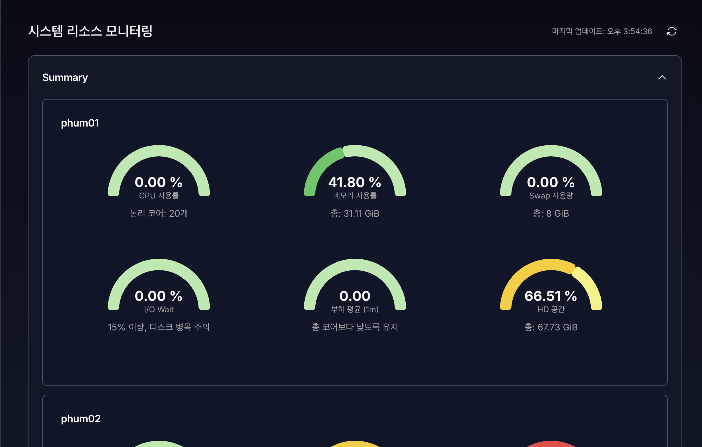

# **9. 리소스 (Resources)**

시스템 리소스 모니터링 화면은 VirtOn 클러스터에 포함된 **각 노드의 CPU, 메모리, 스토리지 사용 현황**과 **현재 실행 중인 가상 머신(VM) 및 컨테이너(LXC)** 상태를 실시간으로 확인하기 위한 화면입니다.

운영자는 이 화면을 통해 클러스터의 부하 상태를 파악하고, 리소스 부족 또는 이상 징후를 조기에 감지할 수 있습니다.

---

## 1. 화면 구성 개요

리소스 모니터링 화면은 다음 영역으로 구성됩니다.

1. 상단 헤더 영역
2. Summary (노드 상태 요약)
3. Storage Pools (스토리지 현황)
4. Memory & CPU Usage (리소스 사용 그래프)
5. Running VMs / Running LXCs (실행 중 리소스 목록)

---

## 2. 상단 헤더 영역

### 표시 항목

- **시스템 리소스 모니터링**  
  현재 페이지의 제목입니다.
- **마지막 업데이트 시간**  
  리소스 정보가 마지막으로 갱신된 시점을 표시합니다.
- **새로고침 버튼**  
  클릭 시 모든 리소스 정보를 즉시 다시 조회합니다.

> 새로고침 중에는 아이콘이 회전하며, 데이터 로딩이 완료되면 자동으로 멈춥니다.

---

## 3. Summary (노드 상태 요약)

클러스터에 포함된 **각 노드의 현재 상태를 요약**해서 보여주는 영역입니다.

### 주요 특징

- 노드별 상태 카드 형태로 표시
- CPU, 메모리, Swap 사용량, 가동 상태 등을 한눈에 확인 가능
- 다수 노드 환경에서도 빠른 상태 파악 가능

### 동작 방식

- 제목 영역을 클릭하면 **접기 / 펼치기**가 가능합니다.
- 기본 상태는 **펼쳐짐**입니다.

---

## 4. Storage Pools (스토리지 현황)

스토리지 풀과 노드별 스토리지 상태를 확인하는 영역입니다.

### 구성 요소

#### 4.1 Shared Storage

- 클러스터에서 사용하는 **공유 스토리지 풀 목록**
- 각 스토리지의:
  - 전체 용량
  - 사용 중인 용량
  - 사용률

#### 4.2 Node Storage

- 노드별 로컬 스토리지 상태
- 노드마다 개별 카드 형태로 표시
- 스토리지 사용률을 시각적으로 확인 가능

### 사용 목적

- 디스크 사용량 과다 여부 확인
- 특정 노드의 스토리지 병목 여부 확인
- HA 및 VM 배치 판단 시 참고 자료로 활용

---

## 5. Memory & CPU Usage (리소스 사용량 그래프)

각 노드의 **CPU 및 메모리 사용량을 시간 흐름에 따라 시각화**한 영역입니다.

### 표시 방식

- 노드별로 섹션이 구분되어 표시
- 각 노드마다 다음 그래프 제공:
  - CPU Usage
  - Memory Usage

---

### 5.1 CPU Usage 그래프

- X축: 시간
- Y축: CPU 사용률 (%)
- 실시간 사용률 추이를 선 그래프로 표시

#### 하단 정보

- 현재 CPU 사용률이 수치로 표시됩니다.
- 급격한 상승이 있는 경우 노드 부하 상태를 의심할 수 있습니다.

---

### 5.2 Memory Usage 그래프

- **Total Memory**: 노드의 전체 메모리 용량
- **Used Memory**: 현재 사용 중인 메모리 용량
- 두 항목을 선 그래프로 동시에 표시

#### 하단 정보

- 총 메모리 (GiB)
- 사용 중인 메모리 (GiB)
- 메모리 사용률 (%)

> 메모리 사용률이 지속적으로 80% 이상일 경우  
> VM 증설 또는 리소스 재배치를 고려해야 합니다.

---

## 6. Running VMs (실행 중인 가상 머신)

현재 **실행 중인 가상 머신(VM)** 목록을 표시하는 테이블입니다.

### 표시 항목

| 항목 | 설명 |
|----|----|
| Time | 상태가 조회된 시각 |
| VM | 가상 머신 이름 |
| Uptime | VM이 실행된 누적 시간 |

### 기능

- 컬럼 헤더 클릭 시 정렬 가능
  - Time 기준
  - VM 이름 기준
  - Uptime 기준
- VM 이름 클릭 시 상세 페이지로 이동 가능

---

## 7. Running LXCs (실행 중인 컨테이너)

현재 **실행 중인 LXC 컨테이너** 목록을 표시합니다.

### 표시 항목

| 항목 | 설명 |
|----|----|
| Time | 상태 조회 시각 |
| VM | 컨테이너 이름 |
| Uptime | 실행 지속 시간 |

> LXC는 VM과 분리하여 표시되며,  
> 컨테이너 기반 워크로드 상태를 빠르게 확인할 수 있습니다.

---

## 8. 상태 및 오류 안내

### Proxmox 설정 미완료 시

- 화면 중앙에 다음 메시지가 표시됩니다.

