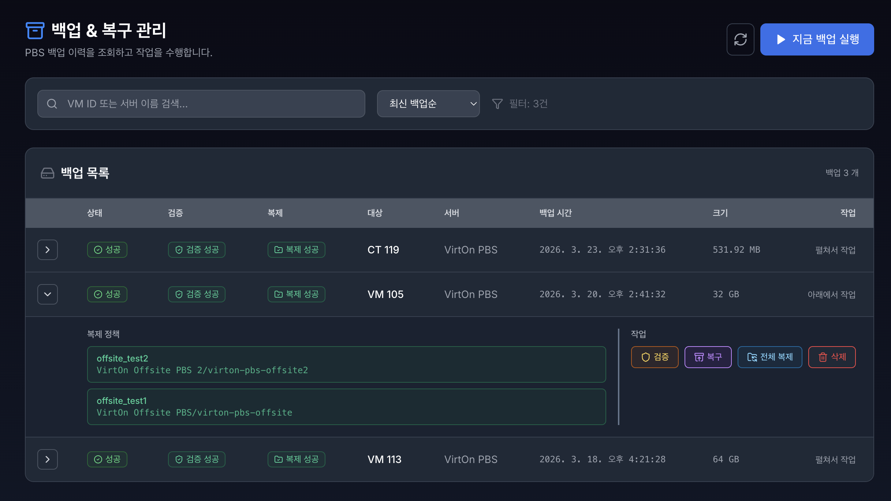
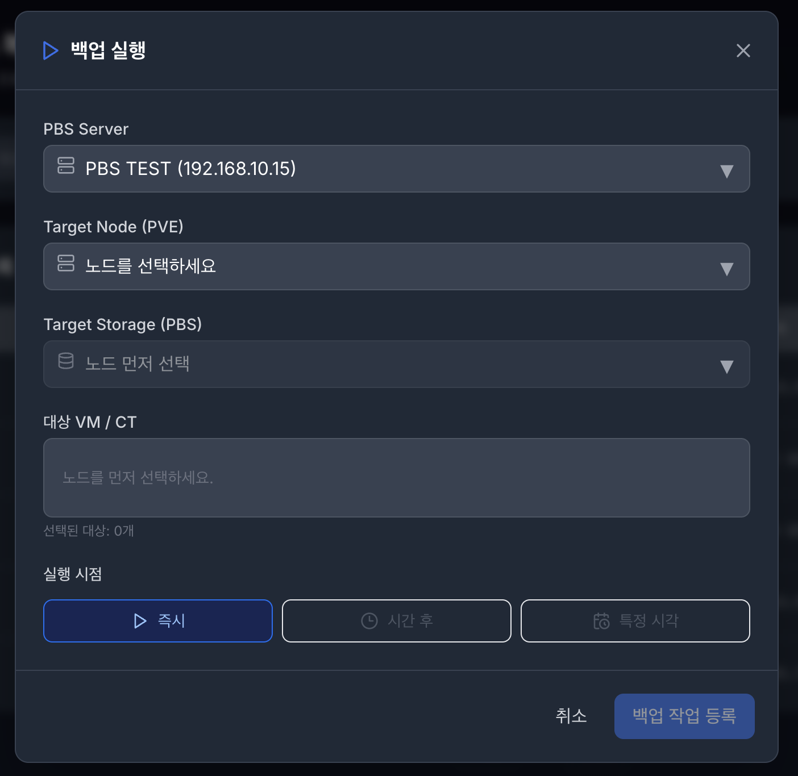
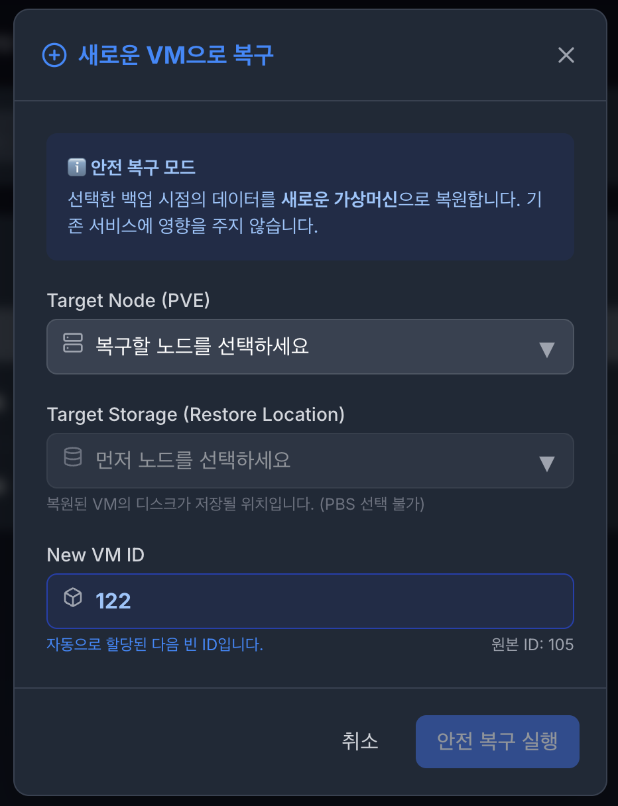
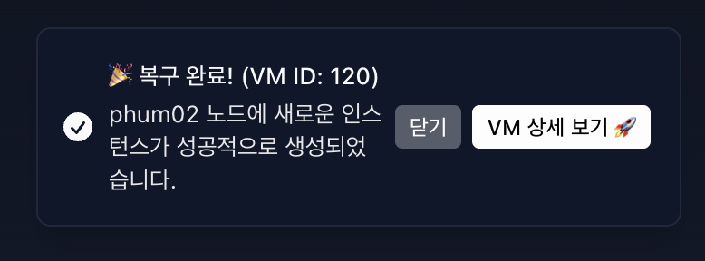
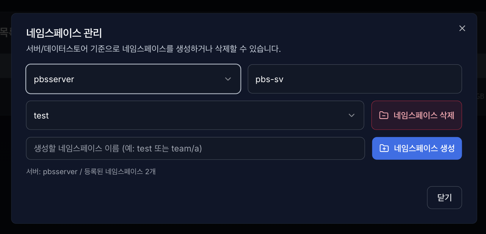

# **3. 백업 & 복구 (backup&restore)**

실제 백업 데이터를 조회하고 새로운 백업을 생성하거나, 과거 시점으로 시스템을 복원, 검증, 복제를 수행하는 핵심 메뉴입니다.

## **3.1. 백업**

- **지금 백업 실행 (Run Backup)**:
    1. **PBS Server** : 백업을 수행할 PBS Server를 선택합니다.
    2. **Target Node (PVE)** : 백업을 수행할 노드를 선택합니다.
    3. **타겟 스토리지 (PBS Storage)** :백업을 수행할 해당 서버의 스토리지를 선택합니다.
    4. **대상 VM / CT** : 백업을 수행할 대상 VM/CT를 선택합니다. (복수개 선택 가능)
    5. **실행 시점** : 백업 실행 시점을 설정합니다.
        - 즉시 : 백업이 순차적으로 바로 실행됩니다.
        - 시간 후 : 몇 시간 후 백업이 될 것인지 설정합니다.
        - 특정 시각 : 백업이 진행될 특정 시간 및 날짜를 선택해 설정합니다.
    6. 백업은 백그라운드에서 안전하게 실행되며, 상단 진행률 바를 통해 1% 단위로 실시간 확인이 가능합니다.
    7. 백업을 실행한 후에는 무결성 검증을 진행하며, 검증을 통과해야 복원 기능을 사용할 수 있습니다.

## **3.2. 복구**

- **복구 (Restore)**:
    1. 특정 백업본의 복구 버튼을 누르면, 시스템이 가장 최적의 새로운 VM ID를 자동으로 추천합니다. 또한 복구를 수행할 노드(Node), 타겟 스토리지 (모든 스토리지 가능) 정보를 입력합니다.
    2. 기존 데이터를 덮어쓰지 않고 새로운 인스턴스로 분리 생성하여 안전성을 높일 수 있습니다. (기존의 VM ID를 사용하면 덮어쓰기도 가능합니다.)
    3. 복구가 완료되면 알림창(Toast)의 **[VM 상세 보기 🚀]** 버튼을 통해 방금 태어난 VM의 관리 페이지로 즉시 이동할 수 있습니다.
    4. 백업 진행 시 무결성 검증을 통과하지 못해 복원 기능이 비활성화 되었다면, 수동 검증 버튼을 통해 재검증 요청이 가능합니다.

## **3.3. 삭제 및 중단**

- **안전한 백업 삭제 (Delete Backup)** :
    1. 불필요한 백업본을 선택해 삭제합니다. Proxmox 서버에 실제 삭제 명령(volid 기반 정밀 타겟팅)을 내려 물리적인 스토리지 용량을 즉시 확보합니다.

- **작업 강제 중단 (Abort Task):** :
    1. 진행률 바 옆의 <kbd>X</kbd> 버튼을 누르면, Proxmox 서버 레벨에서 실행 중인 백업/복구 프로세스(Task)를 강제로 Kill(중단) 하고 DB 상태를 동기화합니다.

## **3.4. 검증 및 복제**

- **백업 파일 검증** :
    1. 현재 백업본이 무결성한지 수동으로 검증합니다. 백업 생성 및 복구 시 자동으로 1회 검증은 수행됩니다.

- **전체 복제** :
    1. 해당 백업 파일을 오프사이트 수동으로 복제합니다. 
    2. 백업 생성 및 복구 시 검증이 완료된 시점에 오프사이트 복제 절차에 따라 복제됩니다. (절차를 설정하지 않으면 복제 진행하지 않음)
    3. 여러 개의 복제 절차가 있을 시, 순차적으로 오프사이트 복제가 됩니다.

    
## **3.5. 네임스페이스 관리**
    

### 3.5.1 기능 목적

- 백업 데이터스토어 내부 네임스페이스를 생성/조회/삭제하여 백업 데이터를 논리적으로 분리 관리합니다.
- 프로젝트/팀/서비스 단위(test, team/a 등)로 백업 영역을 구분할 수 있습니다.

### 3.5.2 화면 구성

- **PBS 서버 선택**
    - 등록된 PBS 서버 목록 중 대상 서버 선택
- **데이터스토어**
    - 선택한 서버의 대상 데이터스토어 표시
- **네임스페이스 선택 드롭다운**
    - 현재 데이터스토어에 존재하는 네임스페이스 목록 조회
    - 비어 있으면 Root(-(Root)) 기준으로 동작
- **네임스페이스 생성 입력**
    - 생성할 네임스페이스 이름 입력 (test, team/a 형태 지원)
- **동작 버튼**
    - 네임스페이스 생성
    - 네임스페이스 삭제
    - 닫기

### 3.5.3 동작 방식

1. 서버 선택
2. 데이터스토어 기준 네임스페이스 목록 로드
3. 필요 시 새 네임스페이스 입력 후 생성
4. 기존 네임스페이스 선택 후 삭제
5. 성공 시 목록 즉시 재조회하여 UI 반영

### 3.5.4 입력/검증 규칙

- 네임스페이스 이름은 공백만 입력 불가
- 중복 네임스페이스 생성 불가
- 존재하지 않는 항목 삭제 요청 불가
- Root 네임스페이스는 시스템 기본 경로로 간주(정책에 따라 삭제 제한 가능)

### 3.5.5 운영 시 주의사항

- 상위/하위 구조(team/a)를 사용할 경우 백업 정책/복구 대상도 동일 구조 기준으로 관리해야 합니다.
- 네임스페이스 삭제 시 해당 경로 백업 데이터 가시성에 영향이 있으므로 사전 확인이 필요합니다.
- 다중 사용자 환경에서는 권한 정책(PBS ACL)과 함께 사용해야 안전합니다.

### 3.5.6 장애/오류 처리

- 서버 연결 실패: 서버 인증/네트워크 상태 확인
- 400/404 오류: 잘못된 네임스페이스 경로 또는 삭제 대상 없음
- 권한 오류(403): 계정 권한 확인 후 재시도
- 실패 시 토스트/알림으로 원인 메시지 표시, 성공 시 목록 자동 갱신 토스트/알림으로 원인 메시지 표시, 성공 시 목록 자동 갱신